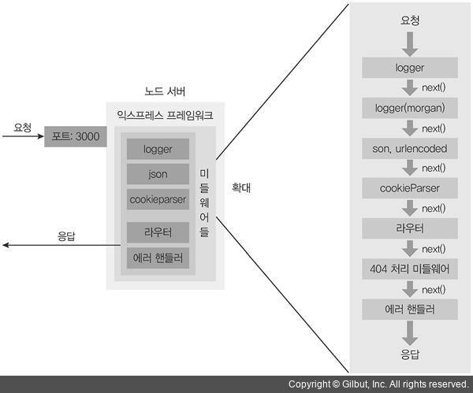

Node.JS Express
===============
Express
------
NodeJS를 사용하여 서버를 개발하고자 하는 개발자들을 위하여 서버를 쉽게 구성할 수 있게 만든 프레임워크


라우팅
------

  * 클라이언트에서 보내는 주소에 따라 다른 처리를 하는 것을 의미   
  * 기본 사용법: app[REST메소드]('주소', 콜백함수, 콜백함수, 콜백함수....)   
  > Rest메소드: use, get, post, put, delete  
  ```javaScript
  app.use('/',function(req,res,next){
    console.log('/ 주소의 요청일 때 실행된다.');
    res.send('주소의 요청일 때 실행된다.');
    next();
  });

  app.get('/',function(req,res,next){
    console.log('GET 메서드 / 주소의 요청일 때만 실행 된다.');
    res.send('GET 메서드 / 주소의 요청일 때만 실행 된다.');
    next();
  });

  app.post('/data',function(req,res,next){
    console.log('POST 메서드 / data 주소의 요청일 때만 실행된다.');
    res.send('POST 메서드 / data 주소의 요청일 때만 실행된다.');
    next();
  });
  ```
  > **use메서드**는 **모든 HTTP 메서드**에 대해 요청 주소만 일치하면 실행되지만,   
   **get, post, put, patch, delete** 같은 메서드는 **주소뿐만 아니라 HTTP 메서드까지 일치 하는 요청**일 때만 실행   
  
  * 주소 부분은 정규 표현식도 가능하고 :(콜론)을 사용한 와일드카드도 가능   
  ```javaScript
  app.get('/page/:pageID', (req, res) => {
    res.send(req.params.pageID)
  });
  ``` 
  
  * 순서도 중요함   
  ```javaScript
  // 예를 들어 아래와 같은 코드에서 위에만 실행되고 아래는 실행이 안됨
  app.get('/page/:pageID', (req, res) => {
    res.send(req.params.pageID + '첫번째') // 실행됨
  });
  
  app.get('/page/a', (req, res) => {
    res.send(req.params.pageID + '두번째') // 안됨
  });
  ```
  
  * 콜백함수 기본 구성: request, response, next   
  ```javaScript
  app.get('/page/:pageID', (req, res) => {
    res.send(req.params.pageID + '첫번째') // 실행됨
  });
  ```
  * request   
    - params: 라우터 파라미터를 지님   
    - query: GET 방식으로 넘어오는 쿼리 스트링 파라미터를 가짐   
    - body: POST 방식으로 넘어오는 파라미터를 지님   
      + 파싱을 위해서는 body-parser와 같은 미들웨어 필요   
    - ... 등등등   
  ```javaScript
const qs = require('querystring');
app.get('/', (req, res) => {
    let body = '';
    req.on('data', function(data){
        body = body + data;
    });
    req.on('end', function(){
      body = qs.parse(body)
      let reSend = `params: ${JSON.stringify(req.params)},
      query: ${JSON.stringify(req.query)},
      body: ${JSON.stringify(body)}`
      let html =`
        ${reSend}
        <form action="/" method="post">
          <input type="text" name="post" />
          <p>
            <input type="submit" value="POST TEST">
          </p>
        </form>
      `
      res.send(html);
    });
});

app.post('/', (req, res) => {
    let body = '';
    req.on('data', function(data){
        body = body + data;
    });
    req.on('end', function(){
      body = qs.parse(body)
      let reSend = `params: ${JSON.stringify(req.params)},
      query: ${JSON.stringify(req.query)},
      body: ${JSON.stringify(body)}`
      let html =`
        ${reSend}
        <form action="/" method="get">
          <input type="text" name="get" />
          <p>
            <input type="submit" value="GET TEST">
          </p>
        </form>
      `
      res.send(html);
    });
});
  ```
  > body-parser
  ```javaScript
  const bodyParser = require('body-parser');
  app.use(bodyParser.urlencoded({ extended: false }));
  app.get('/', (req, res) => {
    let reSend = `params: ${JSON.stringify(req.params)},
    query: ${JSON.stringify(req.query)},
    body: ${JSON.stringify(req.body)}`
    let html =`
      ${reSend}
      <form action="/" method="post">
        <input type="text" name="post" />
        <p>
          <input type="submit" value="POST TEST">
        </p>
      </form>
    `
    res.send(html);
  });
  app.post('/', (req, res) => {
    let reSend = `params: ${JSON.stringify(req.params)},
    query: ${JSON.stringify(req.query)},
    body: ${JSON.stringify(req.body)}`
    let html =`
      ${reSend}
      <form action="/" method="get">
        <input type="text" name="get" />
        <p>
          <input type="submit" value="GET TEST">
        </p>
      </form>
    `
    res.send(html);
  });
  ``` 
  * response   
    - send: 기본적인 만능 메서드   
    - sendFile: 파일을 응답으로 전송   
    - json: Json 전송  
    - redirect: 응답을 다른 라우터로 전송   
    - ... 등등등   
  ```javaScript
  app.get('/redirectTest', (req, res) => {
    res.redirect('/'); // 홈 호출
  });
  ```  
  
  * next   
    + 현재 라우터에서 판단하지 않고 다음 라우터로 넘기는 행위
 ```javaScript
 app.get('/', function(req,res,next){
    console.log('0');
    next();
  },function(req,res,next){
      console.log('1');
      next();
  },function(req,res,next){
      next();
      console.log('2');
  });
   
  app.get('/',function(req,res){
      console.log('3');
  })
  ```
  
  * next('route')   
    - 라우터에 연결된 나머지 미들웨어들을 건너뛰고 싶을 때 사용
      
  ```javaScript
  app.get('/', function(req,res,next){
    console.log('0');
    next('route');
  },function(req,res,next){
      console.log('1');
      next();
  },function(req,res,next){
      next();
      console.log('2');
  });
   
  app.get('/',function(req,res){
      console.log('3');
  })
  ```
  
   > **route외 다른 매개변수 전달시 error로 감**   
  ```javaScript
  app.get('/', function(req,res,next){
    console.log('0');
    next('test입니다.');
  },function(req,res,next){
      console.log('1');
      next();
  },function(req,res,next){
      next();
      console.log('2');
  });
   
  app.use(function(err, req, res, next) {
    res.status(500).send(err);
  })
  ```
  
미들웨어
-------
요청과 응답의 중간(middle, 미들)에 위치하여 미들웨어라 불림   
미들웨어는 주로 app.use와 함께 사용
```javaScript
app.use(logger('dev'));
app.use(express.json());
app.use(express.urlencoded({ extended: false }));
```
app.use 메서드의 인자로 들어 있는 함수가 미들웨어임   
   
> 구조   
   
